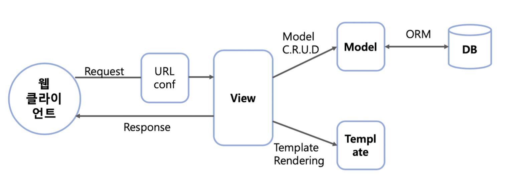

### Django 프로젝트 셋팅

#### Anaconda 설치  
https://www.anaconda.com/products/distribution#Downloads

#### Anaconda 가상환경 생성 
- Anaconda Prompt 실행
```
# 아나콘다 가상환경 조회
conda info --envs 

# 가상환경 생성
condat create -n 가상환경명 

# 가상환경 실행
conda activate 가상환경명
```
> 또는 Anaconda Navigator 로 가상환경 생성

#### Pycharm 프로젝트 생성   
- 파이참 프로젝트 생성 가상환경 셋팅
  - 파이참 메뉴
    - [File] >> [Settings...] >> [Project:프로젝트명] >>  [Python Interpreter] >> [Add Interpreter]  
  > Conda Enviroment    
  Location: C:\(아나콘다설치 경로)\anaconda3\envs\(생성한 가상환경명)   

#### 가상환경 파이썬 버전 바꾸기
```
conda install python=3.7.0
```

### Django 프로젝트 생성
- django 설치
```
pip install django==2.0.0
```

- django 프로젝트 생성 및 config 생성
```
django-admin startproject config .
```
- django App 생성
```
python manage.py startapp 앱이름
```

### Django Flow


- request(요청)  
```
client >> URLConf(urls.py) >> View(views.py) 
>> (Model(model.py) >> Database) >> Template(*.html)
```
- response(응답)
```   
(Database >> Model(model.py)) >> View(views.py) >> Template(*.html) 
>> View(views.py) >> client   
```
- django 실행
```
python manage.py runserver
```

- URLconf(urls.py)
```
# 기본 URL 설정
path('URL', views.함수)

# 그룹 URL 설정
from django.conf.urls import url, include
path('', include('앱이름.urls')),

```
- View(views.py)
```
def 함수명(request):
    # 데이터 베이스 등을 이용한 프로그램 실행 결과
    return HttpResponse()
```
- Template(*.html)
```
<html>
  <!-- html 코드 작성 -->
</html>
```

- 뷰(HTML) 샘플 다운로드   
https://bootstrapmade.com/


